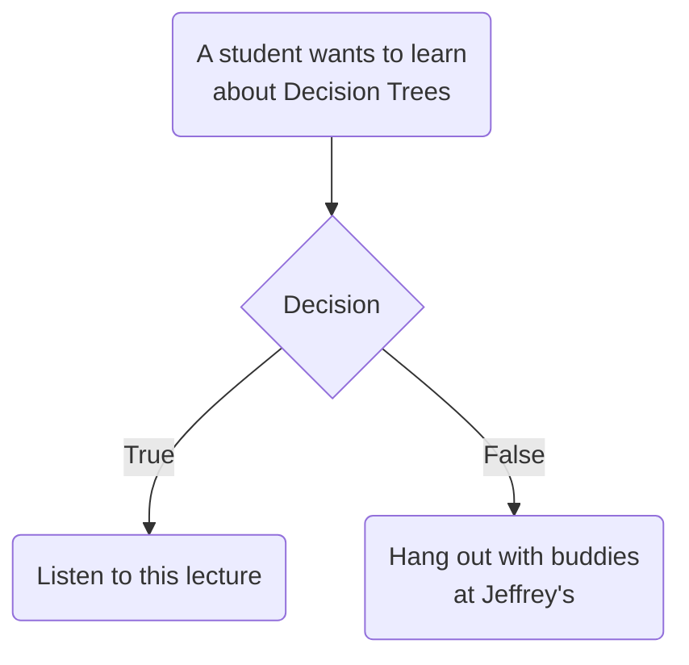

# Decision Trees in Real Life



---

# Decision Trees in Real Life

### Engineering Flowchart
<br>
<div class="grid grid-cols-[5fr_8fr] gap-6">
<div>

```mermaid {securityLevel: 'loose', theme: 'neutral', scale: 1.0, flowchart: {'htmlLabels': true}}
graph TD

A(Does it move?) -->|No| B(Should it?)
A -->|Yes| C(Should it?)
B -->|No| D(No Problem)
B -->|Yes| E("WD-40")
C -->|Yes| F(No Problem)
C -->|No| G("Duct Tape")
```
</div>
<div>
  <figure>
    
      <figcaption style="color:#b3b3b3ff; font-size: 11px; position: absolute;">Image source:<br>
    <a href="https://www.etsy.com/listing/1705553794/wd40-and-duck-tape-holder">https://etsy.com/listing/1705553794/wd40-and-duck-tape-holder</a><br><br>Meme source:<br>
    <a href="https://www.reddit.com/r/funny/comments/vkqd3/the_engineers_flowchart/">https://reddit.com/r/funny/comments/vkqd3/the_engineers_flowchart/</a>
  </figcaption>
  </figure>
</div>
</div>

---

# Decision Trees Example

<div class="grid grid-cols-[4fr_8fr] gap-6">
<div>
<br>
<br>
  <figure>
    
    <figcaption style="color:#b3b3b3ff; font-size: 11px; position: absolute;"><br><br><br><br>Example source:<br>
    <a href="https://towardsdatascience.com/decision-tree-an-algorithm-that-works-like-the-human-brain-8bc0652f1fc6">https://towardsdatascience.com/<br>decision-tree-an-algorithm-that-works-like-the-human-brain-8bc0652f1fc6</a>
  </figcaption>
  </figure>
</div>
<div v-click>
  <figure>
    
  </figure>
</div>
</div>

---

# Decision Trees Regression Example

<br>
<br>
<div class="grid grid-cols-[4fr_4fr] gap-16">
<div>
  <figure>
    
    <figcaption style="color:#b3b3b3ff; font-size: 11px; position: absolute;"><br><br><br>Example based on:<br>
    <a href="https://scikit-learn.org/stable/auto_examples/tree/plot_tree_regression.html">https://scikit-learn.org/stable/auto_examples/tree/plot_tree_regression.html</a>
  </figcaption>
  </figure>
</div>
<div v-click>
  <figure>
    
  </figure>
</div>
</div>

---
zoom: 1.3
---

# Decision Trees Motivation

<v-clicks depth="2">

* Easily created, visualized, and interpreted
* Highly intuitive
	* Mimic the way our brains categorize
* Handle both classification and regression
* Find nonlinear patterns
* Deals well with noisy or incomplete data
* Expand logarithmically based on the number of observations
* Let's understand how they work!
</v-clicks>

---

# Decision Trees Concepts
<br>
<div class="grid grid-cols-[5fr_8fr] gap-6">
<div>

```mermaid {securityLevel: 'loose', theme: 'neutral', scale: 1.0, flowchart: {'htmlLabels': true}}
graph TD

A(<p style="width:70px;height:25px;"></p>) --> B(<p style="width:70px;height:25px;"></p>)
A --> C(<p style="width:70px;height:25px;"></p>)
B --> D(<p style="width:70px;height:25px;"></p>)
B --> E(<p style="width:70px;height:25px;"></p>)
C --> F(<p style="width:70px;height:25px;"></p>)
F --> H(<p style="width:70px;height:25px;"></p>)
C --> G(<p style="width:70px;height:25px;"></p>)
```
</div>
<div>

</div>
</div>

---

# Decision Trees Concepts
<br>
<div class="grid grid-cols-[5fr_8fr] gap-6">
<div>

```mermaid {securityLevel: 'loose', theme: 'neutral', scale: 1.0, flowchart: {'htmlLabels': true}}
graph TD

A(<p style="width:70px;height:25px;">Root</p>) --> B(<p style="width:70px;height:25px;"></p>)
A --> C(<p style="width:70px;height:25px;"></p>)
B --> D(<p style="width:70px;height:25px;"></p>)
B --> E(<p style="width:70px;height:25px;"></p>)
C --> F(<p style="width:70px;height:25px;"></p>)
F --> H(<p style="width:70px;height:25px;"></p>)
C --> G(<p style="width:70px;height:25px;"></p>)
style A fill:#f9f,stroke:#333,stroke-width:4px
```
</div>
<div>

* The very top of the tree is called **Root Node** or **Root**
</div>
</div>

---

# Decision Trees Concepts
<br>
<div class="grid grid-cols-[5fr_8fr] gap-6">
<div>

```mermaid {securityLevel: 'loose', theme: 'neutral', scale: 1.0, flowchart: {'htmlLabels': true}}
graph TD

A(<p style="width:70px;height:25px;">Root</p>) --> B(<p style="width:70px;height:25px;">Branch 1</p>)
A --> C(<p style="width:70px;height:25px;">Branch 2</p>)
B --> D(<p style="width:70px;height:25px;"></p>)
B --> E(<p style="width:70px;height:25px;"></p>)
C --> F(<p style="width:70px;height:25px;">Branch 3</p>)
F --> H(<p style="width:70px;height:25px;"></p>)
C --> G(<p style="width:70px;height:25px;"></p>)
style B fill:#b15f55,stroke:#333,stroke-width:4px
style C fill:#b15f55,stroke:#333,stroke-width:4px
style F fill:#b15f55,stroke:#333,stroke-width:4px
```
</div>
<div>

* The very top of the tree is called **Root Node** or **Root**

* Intermediate nodes are called **Internal nodes** or **Branches**
</div>
</div>

---

# Decision Trees Concepts
<br>
<div class="grid grid-cols-[5fr_8fr] gap-6">
<div>

```mermaid {securityLevel: 'loose', theme: 'neutral', scale: 1.0, flowchart: {'htmlLabels': true}}
graph TD

A(<p style="width:70px;height:25px;">Root</p>) --> B(<p style="width:70px;height:25px;">Branch 1</p>)
A --> C(<p style="width:70px;height:25px;">Branch 2</p>)
B --> D(<p style="width:70px;height:25px;">Leaf 1</p>)
B --> E(<p style="width:70px;height:25px;">Leaf 2</p>)
C --> F(<p style="width:70px;height:25px;">Branch 3</p>)
F --> H(<p style="width:70px;height:25px;">Leaf 4</p>)
C --> G(<p style="width:70px;height:25px;">Leaf 3</p>)
style D fill:#5cb155,stroke:#333,stroke-width:4px
style E fill:#5cb155,stroke:#333,stroke-width:4px
style H fill:#5cb155,stroke:#333,stroke-width:4px
style G fill:#5cb155,stroke:#333,stroke-width:4px
```
</div>
<div>

* The very top of the tree is called **Root Node** or **Root**

* Intermediate nodes are called **Internal nodes** or **Branches**

* Final nodes are called<br> **Leaf Nodes** or **Leaves**
</div>
</div>

---

# Art of Asking Questions

### Where to place the threshold?

<div class="grid grid-cols-[3fr_11fr] gap-10">
<div>
<v-plotly style="width: 400px !important; height: 195px !important"
:data="[{
x: [0.5, 0.9, 1.8, 2.9, 3.0, 3.9, 4.4, 6.0, 7.5, 8.4],
y: Array.from({length: 10}, () => Math.random()*0),
type: 'scatter',
mode: 'markers',
marker: {color: 'red', size: 10, opacity: 0.5},
showlegend: false
},
{
x: [2.3, 3.2, 3.6, 3.8, 4.1, 4.7, 5.5, 6.7, 8.0, 9.5],
y: Array.from({length: 10}, () => Math.random()*0),
type: 'scatter',
mode: 'markers',
marker: {color: 'green', size: 10, opacity: 0.5},
showlegend: false
},
{
x: [7.2],
y: [0],
type: 'scatter',
mode: 'markers',
marker: {color: 'blue', size: 10, symbol: 'cross'},
showlegend: false
}]"
:layout="{
xaxis: {range: [0, 10], zeroline: false},
yaxis: {showticklabels: false, showgrid: false},
margin: {l: 10, r:10, pad: 1},
annotations: [{
    xref: 'paper',
    yref: 'paper',
    x: 1.0,
    y: 0.5,
    xanchor: 'right',
    yanchor: 'bottom',
    text: 'X',
    showarrow: false
  }]
}"
:config="{displayModeBar: false}"
:options="{}"/>
</div>
<div>
<br>
<br>
<br>

#### At random: $X >$ `np.random.uniform(0,10)`
</div>
</div>

<div class="grid grid-cols-[3fr_11fr] gap-10">
<div>
<v-plotly style="width: 400px !important; height: 195px !important"
:data="[{
x: [0.5, 0.9, 1.8, 2.9, 3.0, 3.9, 4.4, 6.0, 7.5, 8.4],
y: Array.from({length: 10}, () => Math.random()*0),
type: 'scatter',
mode: 'markers',
marker: {color: 'red', size: 10, opacity: 0.5},
showlegend: false
},
{
x: [2.3, 3.2, 3.6, 3.8, 4.1, 4.7, 5.5, 6.7, 8.0, 9.5],
y: Array.from({length: 10}, () => Math.random()*0),
type: 'scatter',
mode: 'markers',
marker: {color: 'green', size: 10, opacity: 0.5},
showlegend: false
},
{
x: [5.0],
y: [0],
type: 'scatter',
mode: 'markers',
marker: {color: 'blue', size: 10, symbol: 'cross'},
showlegend: false
}]"
:layout="{
xaxis: {range: [0, 10], zeroline: false},
yaxis: {showticklabels: false, showgrid: false},
margin: {l: 10, r:10, pad: 1},
annotations: [{
    xref: 'paper',
    yref: 'paper',
    x: 1.0,
    y: 0.5,
    xanchor: 'right',
    yanchor: 'bottom',
    text: 'X',
    showarrow: false
  }]
}"
:config="{displayModeBar: false}"
:options="{}"/>
</div>
<div>
<br>
<br>
<br>

#### In the middle ($X > 5$)
</div>
</div>

---

# Art of Asking Questions

### Where to place the threshold?

<div class="grid grid-cols-[3fr_11fr] gap-10">
<div>
<v-plotly style="width: 400px !important; height: 195px !important"
:data="[{
x: [0.5, 0.9, 1.8, 2.9, 3.0, 3.9, 4.4, 6.0, 7.5, 8.4],
y: Array.from({length: 10}, () => Math.random()*0),
type: 'scatter',
mode: 'markers',
marker: {color: 'red', size: 10, opacity: 0.5},
showlegend: false
},
{
x: [2.3, 3.2, 3.6, 3.8, 4.1, 4.7, 5.5, 6.7, 8.0, 9.5],
y: Array.from({length: 10}, () => Math.random()*0),
type: 'scatter',
mode: 'markers',
marker: {color: 'green', size: 10, opacity: 0.5},
showlegend: false
},
{
x: [2.05],
y: [0],
type: 'scatter',
mode: 'markers',
marker: {color: 'blue', size: 10, symbol: 'cross'},
showlegend: false
}]"
:layout="{
xaxis: {range: [0, 10], zeroline: false},
yaxis: {showticklabels: false, showgrid: false},
margin: {l: 10, r:10, pad: 1},
annotations: [{
    xref: 'paper',
    yref: 'paper',
    x: 1.0,
    y: 0.5,
    xanchor: 'right',
    yanchor: 'bottom',
    text: 'X',
    showarrow: false
  }]
}"
:config="{displayModeBar: false}"
:options="{}"/>
</div>
<div>
<br>
<br>
<br>

#### Separate a region with <span style="color:red">**red**</span> class only
</div>
</div>

<div class="grid grid-cols-[3fr_11fr] gap-10">
<div>
<v-plotly style="width: 400px !important; height: 195px !important"
:data="[{
x: [0.5, 0.9, 1.8, 2.9, 3.0, 3.9, 4.4, 6.0, 7.5, 8.4],
y: Array.from({length: 10}, () => Math.random()*0),
type: 'scatter',
mode: 'markers',
marker: {color: 'red', size: 10, opacity: 0.5},
showlegend: false
},
{
x: [2.3, 3.2, 3.6, 3.8, 4.1, 4.7, 5.5, 6.7, 8.0, 9.5],
y: Array.from({length: 10}, () => Math.random()*0),
type: 'scatter',
mode: 'markers',
marker: {color: 'green', size: 10, opacity: 0.5},
showlegend: false
},
{
x: [9.0],
y: [0],
type: 'scatter',
mode: 'markers',
marker: {color: 'blue', size: 10, symbol: 'cross'},
showlegend: false
}]"
:layout="{
xaxis: {range: [0, 10], zeroline: false},
yaxis: {showticklabels: false, showgrid: false},
margin: {l: 10, r:10, pad: 1},
annotations: [{
    xref: 'paper',
    yref: 'paper',
    x: 1.0,
    y: 0.5,
    xanchor: 'right',
    yanchor: 'bottom',
    text: 'X',
    showarrow: false
  }]
}"
:config="{displayModeBar: false}"
:options="{}"/>
</div>
<div>
<br>
<br>
<br>

#### Separate a region with <span style="color:green">**green**</span> class only
</div>
</div>

---

# Art of Asking Questions

### Where to place the threshold?
<br>
<v-clicks>

### Is there anything else to consider?
</v-clicks>

---

# Art of Asking Questions

### What is about 2D?

<div class="grid grid-cols-[3fr_3fr] gap-10">
<div>
<v-plotly style="width: 500px !important; height: 350px !important"
:data="[{
x: [0.16, 0.19, 0.85, 1.13, 1.51, 1.63, 1.78, 2.96, 3.57, 3.82, 4.42, 5.09, 5.23, 5.76, 6.68, 8.78, 9.13],
y: [7.9, 7.5, 0.96, 7.44, 6.91, 4.77, 3.36, 3.16, 3.57, 3.8, 3.1, 1.9, 3.18, 3.9, 6.7, 3.0, 0.65],
type: 'scatter',
mode: 'markers',
marker: {color: 'red', size: 10, opacity: 0.5},
showlegend: false
},
{
x: [3.16, 4.13, 4.76, 5.17, 5.88, 5.95, 6.12, 6.14, 6.42, 6.46, 7.68, 8.4, 9.12, 9.45, 9.26],
y: [5.38, 7.65, 4.44, 5.9, 9.59, 8.25, 7.78, 6.93, 5.73, 9.2, 7.9, 8.7, 8.1, 5.77, 5.32],
type: 'scatter',
mode: 'markers',
marker: {color: 'green', size: 10, opacity: 0.5},
showlegend: false
},
{
x: [3.16, 3.16],
y: [0, 10],
type: 'scatter',
mode: 'lines',
line: {color: 'blue'},
name: 'X<sub>1</sub> first',
showlegend: true,
visible: 'legendonly'
},
{
x: [3.16, 10],
y: [4.44, 4.44],
type: 'scatter',
mode: 'lines',
line: {color: 'blue'},
name: 'X<sub>2</sub> second',
showlegend: true,
visible: 'legendonly'
},
{
x: [3.16, 3.16],
y: [0, 10],
fill: 'tozerox',
fillcolor: 'rgba(255, 0, 0, 0.1)',
type: 'scatter',
mode: 'none',
showlegend: true,
name: 'Red',
legendgroup: 'Reds',
visible: 'legendonly'
},
{
x: [3.16, 10],
y: [4.44, 4.44],
fill: 'tozeroy',
fillcolor: 'rgba(255, 0, 0, 0.1)',
type: 'scatter',
mode: 'none',
showlegend: false,
legendgroup: 'Reds',
visible: 'legendonly'
},
{
x: [0, 10],
y: [7.9, 7.9],
type: 'scatter',
mode: 'lines',
line: {color: 'orange'},
name: 'X<sub>2</sub> first',
showlegend: true,
visible: 'legendonly'
},
{
x: [0.0, 10.0],
y: [10.0, 10.0],
fill: 'tonexty',
fillcolor: 'rgba(0, 255, 0, 0.1)',
type: 'scatter',
mode: 'none',
showlegend: true,
name: 'Green',
legendgroup: 'Greens',
visible: 'legendonly'
},
{
x: [3.16, 3.16],
y: [0.0, 7.9],
type: 'scatter',
mode: 'lines',
line: {color: 'orange'},
name: 'X<sub>1</sub> second',
showlegend: true,
visible: 'legendonly'
}
]"
:layout="{
xaxis: {title: 'X<sub>1</sub>', range: [-0.1, 10.1]},
yaxis: {title: 'X<sub>2</sub>', range: [-0.1, 10.1]},
legend: {x:1.05, y:0.5},
margin: {l: 40, r:0, b:40, t:10, pad: 2}
}"
:config="{displayModeBar: false}"
:options="{}"/>
</div>
<div>
<br>
<br>
<br>
<br>
<v-click>
  <figure>
    
      <figcaption style="color:#b3b3b3ff; font-size: 11px; position: absolute;">Image source:<br>
    <a href="https://makeameme.org/meme/so-many-questions-c6788bc33e">https://makeameme.org/meme/so-many-questions-c6788bc33e</a>
  </figcaption>
  </figure>
</v-click>
</div>
</div>
<br>	

#### To which predictor do we need to apply the split first? $X_1$ or $X_2$?

---

# Art of Asking Questions

### Where to place the threshold?
<br>

<div class="grid grid-cols-[3fr_11fr] gap-10">
<div>
<v-plotly style="width: 400px !important; height: 195px !important"
:data="[{
x: [0.5, 0.9, 1.8, 2.9, 3.0, 3.9, 4.4, 6.0, 7.5, 8.4],
y: Array.from({length: 10}, () => Math.random()*0),
type: 'scatter',
mode: 'markers',
marker: {color: 'red', size: 10, opacity: 0.5},
showlegend: false
},
{
x: [2.3, 3.2, 3.6, 3.8, 4.1, 4.9, 5.5, 6.7, 8.0, 9.5],
y: Array.from({length: 10}, () => Math.random()*0),
type: 'scatter',
mode: 'markers',
marker: {color: 'green', size: 10, opacity: 0.5},
showlegend: false
},
{
x: [5.2],
y: [0],
type: 'scatter',
mode: 'markers',
marker: {color: 'blue', size: 10, symbol: 'cross'},
showlegend: false
}]"
:layout="{
xaxis: {range: [0, 10], zeroline: false},
yaxis: {showticklabels: false, showgrid: false},
margin: {l: 10, r:10, pad: 1},
annotations: [{
    xref: 'paper',
    yref: 'paper',
    x: 1.0,
    y: 0.5,
    xanchor: 'right',
    yanchor: 'bottom',
    text: 'X',
    showarrow: false
  }]
}"
:config="{displayModeBar: false}"
:options="{}"/>
</div>
<div>
<br>
<br>

### Hint: We need to compare the distribution of classes to the left and right of the threshold
</div>
</div>
<v-clicks depth="2">

* Left: 🔴,🔴,🔴,🟢,🔴,🔴,🟢,🟢,🟢,🔴,🟢,🔴,🟢
  * Order doesn't matter: 🔴,🔴,🔴,🔴,🔴,🔴,🔴,🟢,🟢,🟢,🟢,🟢,🟢 $=\{7 \times$ 🔴, $6 \times$ 🟢$\}$
* Right: 🟢,🔴,🟢,🔴,🟢,🔴,🟢 $=\{3 \times$ 🔴, $4 \times$ 🟢$\}$
* Compare with initial (root) distribution: $\{10 \times$ 🔴, $10 \times$ 🟢$\}$
</v-clicks>

---

# Art of Asking Questions

### Where to place the threshold?
### Again:
<div class="grid grid-cols-[3fr_3fr] gap-10">
<div>

* At root: $\{10 \times$ 🔴, $10 \times$ 🟢$\}$
* Left: $\{7 \times$ 🔴, $6 \times$ 🟢$\}$
* Right: $\{3 \times$ 🔴, $4 \times$ 🟢$\}$
</div>
<v-clicks>
<div>

* $I_{\mathrm{root}} = \frac{1}{2}$
* $I_{\mathrm{left}} = 1 - \frac{7}{6+7} = \frac{6}{13}$
* $I_{\mathrm{right}} = 1 - \frac{4}{3+4} = \frac{3}{7}$ 
</div>
</v-clicks>
</div>

Let's define **Impurity** as:

The smaller the variety of the target variable (class) within a set, the smaller the value of the impurity should be.

Let the measure of the impurity be **Misclassification error** - the fraction of the observations in that region that ***do not belong to the most common class***:

$I_{\mathrm{node}} = 1 - \max\limits_k \hat{p}_{mk},$<br>
where $\hat{p}_{mk}$ represents the proportion of observations in the $m$th region that are from the $k$th class.

---

# Art of Asking Questions

### Where to place the threshold?
<br>

### All that's left is to put it all together.

We can calculate **Information Gain** for the particular split:
$$\Delta I_{\mathrm{node}} = I_{\mathrm{node}} - \Big(I_{\mathrm{left}}\frac{N_{\mathrm{left}}}{N_{\mathrm{node}}} + I_{\mathrm{right}}\frac{N_{\mathrm{right}}}{N_{\mathrm{node}}}\Big) \rightarrow \max$$

<v-clicks>
<div class="grid grid-cols-[3fr_2fr_4fr] gap-4">
<div>

* At root: $\{10 \times$ 🔴, $10 \times$ 🟢$\}$
* Left: $\{7 \times$ 🔴, $6 \times$ 🟢$\}$
* Right: $\{3 \times$ 🔴, $4 \times$ 🟢$\}$
</div>
<div>

* $I_{\mathrm{root}} = \frac{1}{2}$
* $I_{\mathrm{left}} = \frac{6}{13}$
* $I_{\mathrm{right}} = \frac{3}{7}$ 
</div>
<div>
<br>

#### $\Delta I_{\mathrm{root}} = \frac{1}{2} - \Big(\frac{6}{13} \cdot \frac{13}{20} + \frac{3}{7} \cdot \frac{7}{20} \Big) = \frac{1}{20}$
</div>
</div>
<br>

#### Best split at $X=3.1$ with $\Delta I_{\mathrm{root}} = \frac{8}{20}$
</v-clicks>

---

# Impurity Measures

### There are 2 more popular impurity measures besides the Misclassification error:
<div class="grid grid-cols-[3fr_4fr] gap-4">
<div>

* **Entropy**:
  * $I_{\mathrm{node}} = - \sum\limits_{k=1}^K \hat{p}_{mk} \log \hat{p}_{mk}$

* **Gini Impurity**:
  * $I_{\mathrm{node}} = - \sum\limits_{k=1}^K \hat{p}_{mk} (1 - \hat{p}_{mk})$
</div>
<div>
<br>
<br>
<figure>

<figcaption style="color:#b3b3b3ff; font-size: 11px;"><br>Image source:
  <a href="https://hastie.su.domains/ElemStatLearn/printings/ESLII_print12.pdf#page=328">ESL Fig. 9.3</a>
</figcaption>
</figure>
</div>
</div>

---
zoom: 1.2
---

# Impurity Measures

### Misclassification error, Entropy and Gini Impurity are similar, except:

* Entropy and the Gini are differentiable, and hence more amenable to numerical optimization

* Entropy and the Gini index are more sensitive to changes in the node probabilities than the misclassification rate

* If we code each observation as $1$ for class $k$ and zero otherwise, the variance over the
node of this $0-1$ response is $\hat{p}_{mk} (1 - \hat{p}_{mk})$. Summing over classes $k$ again
gives the Gini index.

---

# Regression Trees

#### Regression Trees are obtained pretty much the same as Classification Trees but use different quality measures:

* MSE:
  * $I_{\mathrm{node}} = \frac{1}{N_{\mathrm{node}}} \sum\limits_{i=1}^{N_{\mathrm{node}}} (y_i - \mu)^2,~~~$where $\mu = \frac{1}{N_{\mathrm{node}}} \sum\limits_{i=1}^{N_{\mathrm{node}}} y_i~$ is **average** response in the node

* MAE:
  * $I_{\mathrm{node}} = \frac{1}{N_{\mathrm{node}}} \sum\limits_{i=1}^{N_{\mathrm{node}}} \lvert y_i - \mu \rvert,~~~$where $\mu~$ is **median** response in the node

<br>
<br>

####  $N_{\mathrm{node}}$ is number of observations in the node.

---

# Regression Tree Example

<br>
<div class="grid grid-cols-[3fr_3fr] gap-4">
<div>
<figure>

<figcaption style="color:#b3b3b3ff; font-size: 11px; position: absolute;"><br><br>Example based on:<br>
<a href="https://scikit-learn.org/stable/auto_examples/tree/plot_tree_regression.html">https://scikit-learn.org/stable/auto_examples/tree/plot_tree_regression.html</a>
</figcaption>
</figure>
</div>
<div>
<figure>

</figure>
</div>
</div>

---
zoom: 1.1
---

# Stopping Criteria
### We build the tree until a stopping criterion is reached
<br>

### Examples of stopping criteria:
- Maximum depth of the tree
- Minimum number of objects inside a leaf of the tree
- Maximum number of leaves in the tree
- Stopping if all observations in a node belong to the same class

<br>

### Stopping criterion affect the quality of tree predictions
  * Stopping criterion affect the depth of the decision tree
    * Very deep trees are overfitted
    * Shallow trees are underfitted