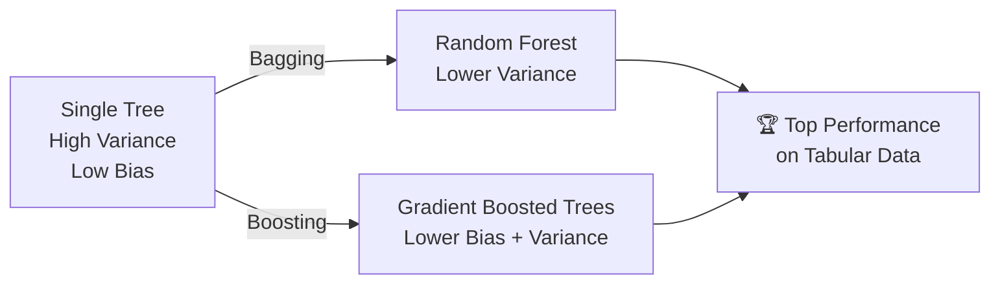

# Trees: The Big Picture

<v-clicks depth="2">

* A decision tree **partitions** the feature space  into **regions** (rectangles)
* Each region gets a **simple prediction**:
	* **Regression**: average of $y$ values in that region
	* **Classification**: majority class in that region
* Built using **binary recursive splitting**  (one feature, one threshold at a time)
* The key question at each node: 
	> *"Which feature and split value best separates the data?"*
* Prediction: find which region $R_m$ the new observation falls into → output $c_m$

</v-clicks>

<v-click at="1">
    <figure>
    
  </figure>
</v-click>

 
 
<v-click at="7">
    <figure>
    
    <figcaption style="color:#b3b3b3ff; font-size: 11px;"> Image source:
      <a href="https://hastie.su.domains/ElemStatLearn/printings/ESLII_print12.pdf#page=325">ESL Fig. 9.2</a>
    </figcaption>
  </figure>
</v-click>

---
zoom: 1.1
---

# Growing Regression Trees

<v-clicks depth="2">

* **Goal**: find regions $\{R_m\}$ that minimize total prediction error (RSS)
* In each region, we predict the **average** response: $\hat{c}_m = \bar{y}_{R_m}$
* Finding the **optimal** partition is computationally intractable (NP-hard)
* So we use a **greedy** approach — at each node:
	1. Try **every feature** $j$ and **every threshold** $s$
	2. Pick the one that minimizes: $\mathrm{RSS}_{\mathrm{Left}} + \mathrm{RSS}_{\mathrm{Right}}$
	3. Split the data and **repeat** on each child node
* This is fast: for each feature, we only need to sort values and scan through thresholds
* **Caveat**: if unconstrained, the tree will overfit — it can create one leaf per observation!

</v-clicks>

<!--
Andrew Ng explains: "The greedy approach doesn't guarantee the globally optimal tree, but in practice it works well. The key is to control the tree's complexity through stopping criteria or pruning."
-->

---
zoom: 1.1
---

# Controlling Tree Complexity

* One approach:
	* Consider threshold $\tau$
	* If $\Delta \mathrm{RSS} > \tau$, continue splitting

* However, $\Delta \mathrm{RSS}$ (or $\Delta \mathrm{MSE}$) can increase   and decrease as the tree grows
	* So, we might stop growing a tree prematurely
* Ex.
	* If $\tau_{\mathrm{MSE}} = 6$, then left branch  would not be built
	* But, in level, $\mathrm{MSE}$ drops by $30.5$

    <figure>
    
    <figcaption style="color:#b3b3b3ff; font-size: 11px;"> Image source:
      <a href="https://towardsdatascience.com/decision-trees-explained-3ec41632ceb6">https://towardsdatascience.com/decision-trees-explained-3ec41632ceb6</a>
    </figcaption>
  </figure>

---
zoom: 0.96
---

# Cost Complexity Pruning

### Strategy: Grow a full tree, then **prune** it back

<v-clicks depth="2">

* **Step 1**: Grow a large tree $T_0$ (possibly overfitting)
* **Step 2**: Find the best subtree by **penalizing complexity**: $C_\alpha(T) = \sum\limits_{m=1}^{|T|} \mathrm{RSS}_m + \alpha \cdot |T|$, where:
	* $|T|$ = number of leaves (tree size)
	* $\alpha \geq 0$ = complexity penalty (like $\lambda$ in Lasso/Ridge!)
	* Small $\alpha$ → large tree (overfit) | Large $\alpha$ → small tree (underfit)
* **Step 3**: Use **cross-validation** to choose optimal $\alpha$
 

* **Weakest link pruning**: sequentially collapse nodes that hurt performance the least

</v-clicks>
 
<v-click>

> *Think of it as regularization for trees: just like Ridge/Lasso penalize large coefficients, pruning penalizes large trees.*

</v-click>

<!--
Josh Starmer explains pruning as "growing a tree that's too big, then trimming it back." The analogy to regularization (which students already know) makes this click immediately. The alpha parameter plays the same role as lambda in Ridge/Lasso.
-->

---

# Growing Classification Trees

<v-clicks depth="2">

* Each leaf predicts the **majority class** in that region
* For splits, we use **impurity measures**  (as discussed earlier):
	* **Gini Impurity** (default in scikit-learn):
		* Probability of misclassifying a random sample
	* **Entropy** (used in ID3/C4.5):
		* Measures uncertainty/surprise in the node
	* **Misclassification error**:
		* Fraction misclassified — but less sensitive,  not recommended for growing
</v-clicks>

 
 
<v-click at="2">
    <figure>
    
    <figcaption style="color:#b3b3b3ff; font-size: 11px;"> Image source:
      <a href="https://hastie.su.domains/ElemStatLearn/printings/ESLII_print12.pdf#page=328">ESL Fig. 9.3</a>
    </figcaption>
  </figure>
</v-click>

<v-clicks at="6">

* For **pruning**, misclassification error is preferred (directly reflects final goal)
* For **growing**, use Gini or Entropy (more sensitive to changes)
</v-clicks>

---

# Missing Values with Trees

<v-clicks depth="3">

* In general, we find ways to **impute** NAs with numeric values   before applying a tree-based model:
	* Categorical feature:
		* Make a new category NA
			* You might discover association between NAs and $Y$
	* Numerical feature:
		1. Choose a (primary) split $X_j < c$ (feature and split value ) as usual, ignoring NAs
		2. Build a list of surrogate splits
			1. Surrogate split that best mimics $X_j < c$
			2. Surrogate split the is next best in mimicking $X_j < c$
			3. ...
		3. When using the tree, if encountering NA, use the next available surrogate
</v-clicks>

---
zoom: 0.96
---

# Feature Importance

### Trees naturally tell you which features matter most!
 

<v-clicks depth="2">

* **Idea**: features used for splits near the **top** of the tree  **are more important**
* **Formally**: sum the impurity decrease across all nodes where feature $j$ was used, weighted by the number of samples:
	* $\mathrm{FI}_j = \sum\limits_{\mathrm{node} \in T(j)} N_{\mathrm{node}} \cdot \Delta I_{\mathrm{node}}$
* **In practice** (`sklearn`):
	* `tree.feature_importances_` gives normalized importance scores
	* Very useful for **feature selection** and **data understanding**
* **Caveat**: biased toward features with many unique values  (high [cardinality](https://en.wikipedia.org/wiki/Cardinality))

</v-clicks>

    <figure>
    
        <figcaption style="color:#b3b3b3ff; font-size: 11px;"> Image source:
      <a href="https://hastie.su.domains/ISLP/ISLP_website.pdf.download.html">ISLP Fig. 8.9</a>
    </figcaption>
  </figure>

<!--
Sebastian Raschka highlights that tree-based feature importance is one of the simplest ways to understand your data. But be careful: correlated features can "steal" importance from each other. Permutation importance is a more robust alternative.
-->

---
zoom: 1.1
---

# Multiway Splits

* In a **binary tree** we build a split $X_j < c$

* In **multiway** split observations based on intervals $[c_{i-1}, c_i)$

 
 

* Disadvantage:
	* Split is too fast
	* Relatively shallow depth  dangers overfitting (difficult to control)

 
 

* Used relatively rarely

 
	<figure>
    
    <figcaption style="color:#b3b3b3ff; font-size: 11px;"> Image source:
      <a href="https://www.displayr.com/how-is-splitting-decided-for-decision-trees">www.displayr.com/how-is-splitting-decided-for-decision-trees</a>
    </figcaption>
  	</figure>

---
zoom: 0.95
---

# High Variance: The Achilles Heel of Trees

<v-clicks depth="2">

* A **small change** in training data can produce  a **completely different** tree
	* Due to hierarchical structure: a change at the root propagates to all branches
	* This is **high variance** — a sign of overfitting
* This is the **main weakness** of decision trees!
</v-clicks>

 
<v-click at="1">
<figure>
	
	<figcaption style="color:#b3b3b3ff; font-size: 11px;">Image source:
	<a href="https://uhlibraries.pressbooks.pub/buildingskillsfordatascience/chapter/random-forest">https://uhlibraries.pressbooks.pub/buildingskillsfordatascience/chapter/random-forest</a>
	</figcaption>
</figure>
</v-click>

 
<v-clicks depth="2">

* **Solutions** (preview of the next week topic):
	* **Bagging**: train many trees on bootstrap samples, average predictions
	* **Random Forests**: bagging + random feature subsets at each split
		* Intentionally diverse trees → averaging reduces variance
	* **Boosting**: sequentially build shallow trees, each correcting errors of previous
	* Limit tree **depth** (simplest approach)
</v-clicks>

<!--
Yaser Abu-Mostafa teaches: the bias-variance tradeoff is THE central concept in machine learning. Trees are a perfect illustration — full trees have zero bias but enormous variance. Ensemble methods (bagging, boosting) are essentially variance-reduction techniques applied to trees.
-->

---
zoom: 0.95
---

# Trees Lack Smoothness of the Prediction Surface

 
 
 

* In classification with 0-1 loss
	* This is not a problem

* In **regression setting**:

	* Can be problematic, where the underlying function is smooth

 
	<figure>
    
     
    
  	</figure>

 
	<figure>
    
     
    
    <figcaption style="color:#b3b3b3ff; font-size: 11px;"> Images source:
      <a href="https://bradleyboehmke.github.io/HOML/DT.html">https://bradleyboehmke.github.io/HOML/DT.html</a>
    </figcaption>
  	</figure>

---

# Patient Rule Induction Method a.k.a Bump Hunting

<!-- * PRIM also looks for a rectangle with high average response -->

* Top-down approach:
	1. Start with all observations 
	2. Greedy edge (**face**) **compression**:
		* Seek edge that maximizes box’s mean after side is trimmed (**peeled off**) by $\alpha$ fraction
		* Compress edges till box converges to a bump (area with high mean)
	3. Pasting (opposite to compression):
		* Expand any edge that increases the new box’s mean

 
	<figure>
     
    
    <figcaption style="color:#b3b3b3ff; font-size: 11px;"> Image source:
      <a href="https://hastie.su.domains/ElemStatLearn/printings/ESLII_print12.pdf#page=338">ESL Fig. 9.7</a>
    </figcaption>
  	</figure>

* The final model has **interpretable** rules: $a_1 \leq X_1 < b_1, a_2 \leq X_2 < b_2, ...$
* PRIM also looks for a rectangle with high average response

---
zoom: 0.95
---

# Decision Trees in Practice: Tips & Tricks

### ✅ Do
 
<v-clicks depth="2">

* **Start simple**: try `max_depth=3` to `5` first
* **Use cross-validation** to tune hyperparameters
* **Visualize** your tree — it's the whole point!
  * `sklearn.tree.plot_tree()` or `export_graphviz()`
* **Check feature importance**  to understand your data
* Use trees for **quick baselines**  before complex models
* **No feature scaling** needed  (unlike linear models, kNN, etc.)

</v-clicks>

<v-click at="8">

### ❌ Don't
</v-click>
 
<v-clicks depth="2">

* Don't grow **unrestricted** trees on noisy data
* Don't expect **smooth** predictions for regression
* Don't trust a single tree  on **high-stakes** decisions
  * Instead, use ensemble methods  (Random Forest, Gradient Boosting)
* Don't ignore **class imbalance** — set `class_weight='balanced'`
* Don't expect trees to **extrapolate**  beyond training range
  * Trees always predict values within the range of training data

</v-clicks>

<!--
Sebastian Raschka always emphasizes: trees are great baselines and great for understanding your data. Andrew Ng's practical advice: start with a simple model, then iterate. Trees embody this philosophy perfectly.
-->

---
zoom: 0.82
---

# Decision Trees: Strengths & Weaknesses

| | |
|---|---|
| ✅ **Strengths** | ❌ **Weaknesses** |
| Highly interpretable ("white box") | High variance — unstable with small data changes |
| No feature scaling needed | Predictions are **not smooth** (step functions) |
| Handles mixed feature types (numeric + categorical) | Greedy algorithm — no global optimum guarantee |
| Captures nonlinear relationships and interactions | Biased toward features with many levels |
| Fast training and prediction | Prone to **overfitting** without constraints |
| Built-in feature importance | **Cannot extrapolate** beyond training data range |
| Handles missing data (with surrogates) | Poor with linear relationships (needs many splits) |

 
<v-click>

> *"A single decision tree is rarely the best model for any task, but it's often the **most useful** model for understanding your data —  and it's the building block for the most powerful ensemble methods."*

</v-click>

<!--
Andrej Karpathy notes that in practice, gradient-boosted trees (XGBoost, LightGBM) dominate tabular data competitions. But understanding single trees is essential — they are the atoms from which these powerful models are built.
-->

---
zoom: 0.9
---

# Trees as Building Blocks

### Why did we spend so much time on single trees?

<v-clicks depth="2">

* A single tree is **interpretable** but **not accurate** enough
* **Ensemble methods** combine many trees to get the best of both worlds:
  * **Bagging** (Bootstrap Aggregating): reduce variance by averaging many trees
  * **Random Forest**: bagging + feature randomization → decorrelated trees
  * **Boosting** (AdaBoost, Gradient Boosting, XGBoost): sequentially correct errors
* These are among the **most powerful methods** for tabular data
  * XGBoost, LightGBM, CatBoost dominate Kaggle competitions on structured data
* **Coming up in next lectures!**

</v-clicks>

 
<v-click>

</v-click>

<!--
Andrej Karpathy famously called neural networks 'the second thing to try' for tabular data. Gradient-boosted trees are still king for structured/tabular datasets. Yoshua Bengio's group has been working to bridge this gap with models like TabNet, but GBDTs remain dominant in practice.
-->